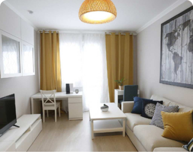

1. В стили к селектору `.successfull` добавить `z-index:999;`

2. html код блока:
```html
<div class="finish">
    <div class="container">
      <div class="finish__title">
        Поздравляем с <br> осуществлением мечты!
      </div>
      <div class="finish-slider">
        <button class="finish-btn finish-slider__prev">
          <svg width="9" height="15" viewBox="0 0 9 15" fill="none" xmlns="http://www.w3.org/2000/svg">
            <path d="M8 1L2 7.5L8 14" stroke="white" stroke-width="2" />
          </svg>

        </button>
        <button class="finish-btn finish-slider__next">
          <svg width="9" height="15" viewBox="0 0 9 15" fill="none" xmlns="http://www.w3.org/2000/svg">
            <path d="M1 1L7 7.5L1 14" stroke="white" stroke-width="2" />
          </svg>

        </button>
        <div class="finish-slider__track">
          <div class="finish-slide">
            <div class="bank__item catalog__content-item">
              <div class="finish-slide__img">
                
                <div class="finish-slide__img-text">
                  <div class="finish-slide__img-text__inner">
                    НАКОПЛЕНО <br> 100%
                    <div class="finish-slide__img-text__blur">
                      НАКОПЛЕНО <br> 100%
                    </div>
                  </div>

                </div>
              </div>

              <div class="bank__content">
                <div class="bank__title">
                  <div class="bank__title-text">
                    Мечтаю снимать квартиру в СПБ
                  </div>
                  <span class="bank__title-blur">Мечтаю снимать квартиру в СПБ</span>
                </div>
                <div class="bank__purpose">
                  Цель: 30.00 <span class="ruble-sign">₽</span>
                  <span class="bank__purpose-blur">Цель: 30.00 <span class="ruble-sign">₽</span></span>
                </div>
                <div class="bank__text">Прогресс: 0%</div>
                <div class="bank__text">Осталось дней: - ∞</div>
                <div class="bank__text">Финансировано: 0.00 <span class="ruble-sign">₽</span></div>
                <div class="bank__user">
                  
                  <div class="bank__user-text">Константин</div>
                </div>
              </div>
            </div>
          </div>
          <div class="finish-slide">
            <div class="bank__item catalog__content-item">
              <div class="finish-slide__img">
                
                <div class="finish-slide__img-text">
                  <div class="finish-slide__img-text__inner">
                    НАКОПЛЕНО <br> 100%
                    <div class="finish-slide__img-text__blur">
                      НАКОПЛЕНО <br> 100%
                    </div>
                  </div>

                </div>
              </div>

              <div class="bank__content">
                <div class="bank__title">
                  <div class="bank__title-text">
                    Мечтаю снимать квартиру в СПБ
                  </div>
                  <span class="bank__title-blur">Мечтаю снимать квартиру в СПБ</span>
                </div>
                <div class="bank__purpose">
                  Цель: 30.00 <span class="ruble-sign">₽</span>
                  <span class="bank__purpose-blur">Цель: 30.00 <span class="ruble-sign">₽</span></span>
                </div>
                <div class="bank__text">Прогресс: 0%</div>
                <div class="bank__text">Осталось дней: - ∞</div>
                <div class="bank__text">Финансировано: 0.00 <span class="ruble-sign">₽</span></div>
                <div class="bank__user">
                  
                  <div class="bank__user-text">Константин</div>
                </div>
              </div>
            </div>
          </div>
          <div class="finish-slide">
            <div class="bank__item catalog__content-item">
              <div class="finish-slide__img">
                
                <div class="finish-slide__img-text">
                  <div class="finish-slide__img-text__inner">
                    НАКОПЛЕНО <br> 100%
                    <div class="finish-slide__img-text__blur">
                      НАКОПЛЕНО <br> 100%
                    </div>
                  </div>

                </div>
              </div>

              <div class="bank__content">
                <div class="bank__title">
                  <div class="bank__title-text">
                    Мечтаю снимать квартиру в СПБ
                  </div>
                  <span class="bank__title-blur">Мечтаю снимать квартиру в СПБ</span>
                </div>
                <div class="bank__purpose">
                  Цель: 30.00 <span class="ruble-sign">₽</span>
                  <span class="bank__purpose-blur">Цель: 30.00 <span class="ruble-sign">₽</span></span>
                </div>
                <div class="bank__text">Прогресс: 0%</div>
                <div class="bank__text">Осталось дней: - ∞</div>
                <div class="bank__text">Финансировано: 0.00 <span class="ruble-sign">₽</span></div>
                <div class="bank__user">
                  
                  <div class="bank__user-text">Константин</div>
                </div>
              </div>
            </div>
          </div>
          <div class="finish-slide">
            <div class="bank__item catalog__content-item">
              <div class="finish-slide__img">
                
                <div class="finish-slide__img-text">
                  <div class="finish-slide__img-text__inner">
                    НАКОПЛЕНО <br> 100%
                    <div class="finish-slide__img-text__blur">
                      НАКОПЛЕНО <br> 100%
                    </div>
                  </div>

                </div>
              </div>

              <div class="bank__content">
                <div class="bank__title">
                  <div class="bank__title-text">
                    Мечтаю снимать квартиру в СПБ
                  </div>
                  <span class="bank__title-blur">Мечтаю снимать квартиру в СПБ</span>
                </div>
                <div class="bank__purpose">
                  Цель: 30.00 <span class="ruble-sign">₽</span>
                  <span class="bank__purpose-blur">Цель: 30.00 <span class="ruble-sign">₽</span></span>
                </div>
                <div class="bank__text">Прогресс: 0%</div>
                <div class="bank__text">Осталось дней: - ∞</div>
                <div class="bank__text">Финансировано: 0.00 <span class="ruble-sign">₽</span></div>
                <div class="bank__user">
                  
                  <div class="bank__user-text">Константин</div>
                </div>
              </div>
            </div>
          </div>
          <div class="finish-slide">
            <div class="bank__item catalog__content-item">
              <div class="finish-slide__img">
                
                <div class="finish-slide__img-text">
                  <div class="finish-slide__img-text__inner">
                    НАКОПЛЕНО <br> 100%
                    <div class="finish-slide__img-text__blur">
                      НАКОПЛЕНО <br> 100%
                    </div>
                  </div>

                </div>
              </div>

              <div class="bank__content">
                <div class="bank__title">
                  <div class="bank__title-text">
                    Мечтаю снимать квартиру в СПБ
                  </div>
                  <span class="bank__title-blur">Мечтаю снимать квартиру в СПБ</span>
                </div>
                <div class="bank__purpose">
                  Цель: 30.00 <span class="ruble-sign">₽</span>
                  <span class="bank__purpose-blur">Цель: 30.00 <span class="ruble-sign">₽</span></span>
                </div>
                <div class="bank__text">Прогресс: 0%</div>
                <div class="bank__text">Осталось дней: - ∞</div>
                <div class="bank__text">Финансировано: 0.00 <span class="ruble-sign">₽</span></div>
                <div class="bank__user">
                  
                  <div class="bank__user-text">Константин</div>
                </div>
              </div>
            </div>
          </div>
          <div class="finish-slide">
            <div class="bank__item catalog__content-item">
              <div class="finish-slide__img">
                
                <div class="finish-slide__img-text">
                  <div class="finish-slide__img-text__inner">
                    НАКОПЛЕНО <br> 100%
                    <div class="finish-slide__img-text__blur">
                      НАКОПЛЕНО <br> 100%
                    </div>
                  </div>

                </div>
              </div>

              <div class="bank__content">
                <div class="bank__title">
                  <div class="bank__title-text">
                    Мечтаю снимать квартиру в СПБ
                  </div>
                  <span class="bank__title-blur">Мечтаю снимать квартиру в СПБ</span>
                </div>
                <div class="bank__purpose">
                  Цель: 30.00 <span class="ruble-sign">₽</span>
                  <span class="bank__purpose-blur">Цель: 30.00 <span class="ruble-sign">₽</span></span>
                </div>
                <div class="bank__text">Прогресс: 0%</div>
                <div class="bank__text">Осталось дней: - ∞</div>
                <div class="bank__text">Финансировано: 0.00 <span class="ruble-sign">₽</span></div>
                <div class="bank__user">
                  
                  <div class="bank__user-text">Константин</div>
                </div>
              </div>
            </div>
          </div>
        </div>

      </div>
    </div>

  </div>
```

* css блока:

```css

.slick-list {
  overflow: hidden;
}

.slick-track {
  display: flex;
}

.finish {
  padding: 0 80px;
  padding-top: 180px;
  overflow: hidden;
  position: relative;
}

.finish::after {
  content: '';
  position: absolute;
  display: block;
  top: 0;
  left: 0;
  width: 100%;
  height: 390px;
  background: url('../../firework.png') no-repeat center;
}

@media (max-width:1024px) {
  .finish::after {
    height: 300px;
  }
}
@media (max-width:768px) {
  .finish::after {
    height: 200px;
  }
}

.finish-slider {
  position: relative;
}

.finish-btn {
  background: none;
  border: none;

  width: 43px;
  height: 43px;
  background: rgba(19, 18, 18, 0.45);
  border-radius: 50%;
  cursor: pointer;

  display: inline-flex;
  align-items: center;
  justify-content: center;
  position: absolute;
  top: 50%;
  transform: translateY(50%);
}

.finish-slider__prev {
  left: -70px;
}

.finish-slider__next {
  right: -70px;
}

@media (max-width:1024px) {
  .finish-btn {
    background: none;
    border: none;
  
    width: 43px;
    height: 43px;
    background: rgba(19, 18, 18, 0.45);
    border-radius: 50%;
    cursor: pointer;
  
    display: inline-flex;
    align-items: center;
    justify-content: center;
    position: absolute;
    top: 100%;
    transform: translateY(50%);
  }
  
  .finish-slider__prev {
    left: 40%;
  }
  
  .finish-slider__next {
    right: 40%;
  }
}

@media (max-width:567px) {
  .finish-slider__prev {
    left: 10%;
  }
  
  .finish-slider__next {
    right: 10%;
  }
}

.finish-btn:hover,
.finish-btn:focus {
  border: solid 1px #131842;
}

.finish__title {
  margin-bottom: 80px;
  text-align: center;
  font-size: 40px;
  font-weight: 700;
  filter: blur(1px);
  line-height: 48px;
}

.finish .bank__title,
.finish .bank__title-blur {
  font-size: 24px;
  font-weight: 600;
  line-height: 34px;
}

.finish .bank__purpose,
.finish .bank__purpose-blur {
  font-size: 20px;
}

.finish .bank__text {
  font-size: 16px;
}

@media (max-width:1024px) {
  .finish {
    padding:  50px 0 100px 0;
  }

  .finish__title {
    line-height: 28px;
    margin-bottom: 40px;
  }


  .finish-slide__img {
    min-height: 250px;
  }

  .finish .bank__title,
  .finish .bank__title-blur {
    font-size: 18px;
    font-weight: 600;
    line-height: 34px;
  }

  .finish .bank__purpose,
  .finish .bank__purpose-blur {
    font-size: 16px;
  }

  .finish .bank__text {
    font-size: 14px;
  }
}

@media (max-width:768px) {
  .finish {
    padding-top: 80px;
  }

  .finish__title {
    font-size: 30px;
    line-height: 28px;
    margin-bottom: 40px;
  }

  .finish-slide__img {
    min-height: 100px;
  }
}

@media (max-width:567px) {
  .finish {
    padding: 30px 0 70px 0;
  }
}

.finish-slide__img {
  overflow: hidden;
  border-radius: 13.5714px 13.5714px 0px 0px;
  max-height: none;
  position: relative;
}

.finish-slide__img img {
  width: 100%;
  height: 100%;
  max-height: none;
  object-fit: cover;
}

.finish-slider .catalog__content-item {
  width: 100%;
  height: 100% !important;
  margin: 0;
}

.finish-slide {
  padding: 0 15px;
}

.finish-ava {
  width: 47px;
  height: 47px;
  overflow: hidden;
  object-fit: cover;
  border-radius: 50%;
  margin-right: 20px;
}

.finish-slide__img-text {
  position: absolute;
  top: 50%;
  left: 50%;
  transform: translate(-50%, -50%);
  background: #131842;
  padding: 16px 35px;
  text-align: center;
  background: #131842;
  border-radius: 15px;

  font-weight: 900;
font-size: 20px;
line-height: 120%;
}

.finish-slide__img-text__inner {
  position: relative;
  font-size: 20px;
}

.finish-slide__img-text__blur {
  text-align: center;
  font-size: 20px;
  color: rgba(20, 212, 224, 0.71);
  font-weight: 900;
  line-height: 24px;
  filter: blur(5px);
  position: absolute;
  z-index: -1;
  top: 0;
  left: 0;
  -webkit-line-clamp: 2;
  display: -webkit-box;
  -webkit-box-orient: vertical;
  overflow: hidden;
}


```


* js код для блока: 
``` js 
$('.finish-slider__track').slick({
        arrows: false,
        slidesToShow: 3,
        infinite: false,

        prevArrow: $('.finish-slider__prev'),
        nextArrow: $('.finish-slider__next'),

        responsive: [
          {
            breakpoint: 980,
            settings: {
              slidesToShow: 2,
            }
          },
          {
            breakpoint: 650,
            settings: {
              slidesToShow: 1,
            }
          },
        ]
      });

      $('.finish-slider__prev').click(() => {
        $('.finish-slider__track').slick('slickPrev')
      });
      $('.finish-slider__next').click(() => {
        $('.finish-slider__track').slick('slickNext')
      });
```